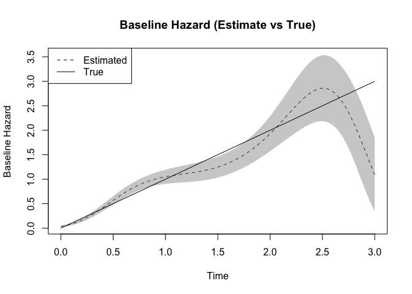

<!-- README.md is generated from README.Rmd. Please edit that file -->

# CoxStream

<!-- badges: start -->

[](https://lifecycle.r-lib.org/articles/stages.html#experimental)
[](https://CRAN.R-project.org/package=coxstream)
[](https://github.com/SignorinoY/coxstream/actions/workflows/R-CMD-check.yaml)
[](https://app.codecov.io/gh/SignorinoY/coxstream)
<!-- badges: end -->

The goal of coxstream is to …

## Installation

You can install the development version of coxstream like so:

``` r
# install.packages("pak")
pak::pak("SignorinoY/coxstream")
```

## Example

This is a basic example which shows you how to solve a common problem:

``` r
library(coxstream)
## basic example code
formula <- survival::Surv(time, status) ~ X1 + X2 + X3 + X4 + X5
fit <- coxstream(
  formula, sim[sim$batch_id == 1, ],
  degree = 4, boundary = c(0, 3), idx_col = "patient_id"
)
for (batch in 2:10) {
  fit <- update(fit, sim[sim$batch_id == batch, ])
}
summary(fit)
#> Call:
#> coxstream(formula = formula, data = sim[sim$batch_id == 1, ], 
#>     degree = 4, boundary = c(0, 3), idx_col = "patient_id")
#> 
#>       coef exp(coef)      se     z      p    
#> X1 0.96860   2.63426 0.05107 18.97 <2e-16 ***
#> X2 0.99686   2.70976 0.05355 18.61 <2e-16 ***
#> X3 0.99161   2.69557 0.05368 18.47 <2e-16 ***
#> X4 0.88254   2.41704 0.05205 16.96 <2e-16 ***
#> X5 1.01817   2.76811 0.05092 19.99 <2e-16 ***
#> ---
#> Signif. codes:  0 '***' 0.001 '**' 0.01 '*' 0.05 '.' 0.1 ' ' 1
#>    exp(coef) exp(-coef) lower .95 upper .95
#> X1 2.6343    0.3796     2.3833    2.9116   
#> X2 2.7098    0.3690     2.4398    3.0096   
#> X3 2.6956    0.3710     2.4264    2.9946   
#> X4 2.4170    0.4137     2.1826    2.6766   
#> X5 2.7681    0.3613     2.5052    3.0587
```

Besides the estimated coefficients, we can also obtain the estimated
baseline hazard function. The following code plots the estimated
baseline hazard function and the true baseline hazard function.

``` r
time <- seq(0, 3, length.out = 100)
basehaz_pred <- basehaz(fit, time)
basehaz_true <- cbind(time, time)
plot(
  time, basehaz_pred[, 2],
  type = "l", lty = 2,
  ylim = range(basehaz_pred[, 4], basehaz_pred[, 5]),
  xlab = "Time", ylab = "Baseline Hazard",
  main = "Baseline Hazard (Estimate vs True)"
)
polygon(
  c(time, rev(time)), c(basehaz_pred[, 4], rev(basehaz_pred[, 5])),
  col = rgb(0.5, 0.5, 0.5, 0.4), border = NA
)
lines(basehaz_true[, 1], basehaz_true[, 2])
legend("topleft", legend = c("Estimated", "True"), lty = c(2, 1))
```


